# Documento de análisis de métricas

En este documento de Jupyter Notebook vamos a analizar las métricas propuestas en el **Documento de investigación**

Para ello se va a empezar uniendo todos los archivos .json que hay en la carpeta **./JSONS** en un solo .json, tras ello se harán los cálculos correspondientes.


```python
import pandas as pd
import os
import json
import numpy as np
```


```python
folder="./JSONS"
combinedData=[]
for file in os.listdir(folder):
    if(file.endswith('.json')):
        route=os.path.join(folder,file)
        with open(route,'r')as f:
            jsonfile=json.load(f)
            combinedData.extend(jsonfile['data'])
jsonFile={'data':combinedData}
with open('data_combined.json', 'w') as f:
    json.dump(jsonFile, f)
```


```python
x = pd.json_normalize(jsonFile['data'])
groupedEvents = x.groupby('eventType')
##for eid, group in groupedEvents:
    ##display(group)
    ##display(eid)
```

### Los eventos y sus ID:
```C#
//Eventos comunes
 SessionStart = 0
 SessionStop = 1
 GameStart = 2
 GameEnd = 3
 LevelStart = 4
 LevelEnd = 5
 Pause = 6
 Resume = 7
 // Eventos de juego
 Attack = 8
 EnemyReceive = 9
 PlayerReceive = 10
 PlayerDead = 11
 RoomMove = 12
```


# Métrica 1: Tiempo de finalización de nivel
¿El jugador tarda demasiado tiempo en completar cada uno de los dos niveles?


```python
from datetime import datetime,timedelta
import matplotlib.pyplot as plt
startEvent = groupedEvents.get_group(4)
#display(startEvent)
endEvent = groupedEvents.get_group(5)
#display(endEvent)
#Filtrar niveles completados con éxito
endEvent_filtered = endEvent[endEvent['LevelEnd'] == 0]
startEvent_filtered = startEvent[startEvent['Level'].isin(endEvent_filtered['Level']) & startEvent['GameSession'].isin(endEvent_filtered['GameSession'])]
endEvent_filtered = endEvent_filtered.copy()
#nueva columna de eventos end por nivel
endEvent_filtered.loc[:, 'combined'] = endEvent_filtered['Level'].astype(str) + '-' + endEvent_filtered['GameSession'].astype(str)
startEvent = startEvent.copy()
#Nueva columna de eventos start por nivel
startEvent.loc[:, 'combined'] = startEvent['Level'].astype(str) + '-' + startEvent['GameSession'].astype(str)
startEvent_filtered = startEvent[startEvent['combined'].isin(endEvent_filtered['combined'])]
#Borrar cols
del startEvent_filtered['combined']
del endEvent_filtered['combined']

durations = []
for i in range(len(startEvent_filtered)):
    #Timestamps de inicio y fin
    start_time = startEvent_filtered.iloc[i]['timestamp']
    end_time = endEvent_filtered.iloc[i]['timestamp']
    total_pause_duration = 0
    #Comprobar pausas/resumes
    if 6 in groupedEvents.groups and 7 in groupedEvents.groups:
        pauseEvents = groupedEvents.get_group(6)
        resumeEvents = groupedEvents.get_group(7)
        #Filtrar pausas
        pauses_in_range = pauseEvents[(pauseEvents['timestamp'] >= start_time) & (pauseEvents['timestamp'] <= end_time)]
        resumes_in_range = resumeEvents[(resumeEvents['timestamp'] >= start_time) & (resumeEvents['timestamp'] <= end_time)]
        
        #Sumar tiempo pausa
        for j in range(len(pauses_in_range)):
            pause_time = pauses_in_range.iloc[j]['timestamp']
            resume_time = resumes_in_range.iloc[j]['timestamp']
            pause_duration = resume_time - pause_time
            total_pause_duration += pause_duration
            
    a_seconds = start_time / 1000
    b_seconds = end_time / 1000
    total_pause_duration= total_pause_duration / 1000
    #duración
    duration = b_seconds - a_seconds- total_pause_duration
    durations.append(duration)

startEvent_filtered = startEvent_filtered.copy()
#nueva columna de duraciones, más abajo se borra
startEvent_filtered['duration'] = durations

#Separar los eventos por nivel
level1_events = startEvent_filtered[startEvent_filtered['Level'] == 1]
level2_events = startEvent_filtered[startEvent_filtered['Level'] == 2]

#Media de las duraciones para cada nivel
mean_duration_level1 = level1_events['duration'].mean()
mean_duration_level2 = level2_events['duration'].mean()
#Mediana de las duraciones de cada nivel
median_duration_level1 = level1_events['duration'].median()
median_duration_level2 = level2_events['duration'].median()
max_duration_level1 = level1_events['duration'].max()
max_duration_level2 = level2_events['duration'].max()
#Desv. típicas
std_duration_level1 = level1_events['duration'].std()
std_duration_level2 = level2_events['duration'].std()

maxi = max(max_duration_level1, max_duration_level2)
print("Media de las duraciones del nivel 1: ", mean_duration_level1)
print("Mediana de las duraciones del nivel 1: ", median_duration_level1)
print("Desviación típica de las duraciones del nivel 1: ", std_duration_level1)
#Histograma Nivel 1
plt.hist(level1_events['duration'], bins=10, range=(0,maxi), edgecolor='black')
plt.title('Nivel 1')
plt.xlabel('Duración (segundos)')
plt.ylabel('Frecuencia')
#rotar
plt.xticks(rotation=45)
plt.show()
print("Media de las duraciones del nivel 2: ", mean_duration_level2)
print("Mediana de las duraciones del nivel 2: ", median_duration_level2)
print("Desviación típica de las duraciones del nivel 2: ", std_duration_level2)
#Histograma Nivel 2
plt.hist(level2_events['duration'], bins=10, edgecolor='black')
plt.title('Nivel 2')
plt.xlabel('Duración (segundos)')
plt.ylabel('Frecuencia')
#rotar
plt.xticks(rotation=45)
plt.show()
del startEvent_filtered['duration']
```

    Media de las duraciones del nivel 1:  90.95006670951844
    Mediana de las duraciones del nivel 1:  71.89100003242493
    Desviación típica de las duraciones del nivel 1:  58.982521595559646
    


    
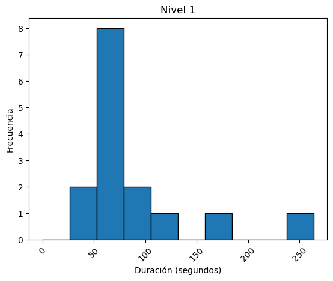
    


    Media de las duraciones del nivel 2:  72.01957140650067
    Mediana de las duraciones del nivel 2:  75.79500007629395
    Desviación típica de las duraciones del nivel 2:  12.060731050539216
    


    
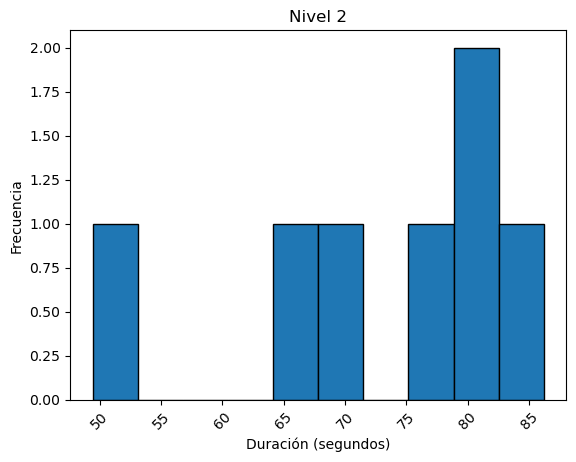
    


# Métrica 2: Cantidad de movimientos por nivel
¿El jugador usa demasiados movimientos de salas en cada uno de los dos niveles?


```python
#Eventos de movimiento de sala
room_moves = groupedEvents.get_group(11)

#Agrupar los movimientos por sesión y nivel
movements = room_moves.groupby(['GameSession', 'Level']).size().reset_index(name='Movements')

#Obtener las sesiones únicas de los eventos de fin
endEventSessions = endEvent_filtered['GameSession'].unique()

#LevelIDs de los eventos completados
completed_levels = endEvent_filtered[endEvent_filtered['LevelEnd'] == 0]['Level'].unique()
#Filtrar los movimientos que pertenecen a una sesión de juego completada
completed_room_moves = room_moves[(room_moves['GameSession'].isin(endEventSessions)) & (room_moves['Level'].isin(completed_levels))]

#Agrupar los movimientos filtrados por sesión y nivel
completed_movements = completed_room_moves.groupby(['GameSession', 'Level']).size().reset_index(name='Movements')

#Level 1
filtered_movements_1 = completed_movements[completed_movements['Level'] == 1.0]
conteos_nivel_1 = {}

#Iterar sobre las filas de filtered_movements_1
for index, fila in filtered_movements_1.iterrows():
    movimientos = fila['Movements']
    #Redondear
    clave=int(movimientos/5)
    clave= clave*5
    if clave in conteos_nivel_1:
        conteos_nivel_1[clave]=conteos_nivel_1[clave]+1
    else:
        conteos_nivel_1[clave]=1

moda = max(conteos_nivel_1, key=lambda k: conteos_nivel_1[k])

#Obtener las claves y valores del diccionario
claves = list(conteos_nivel_1.keys())
valores = list(conteos_nivel_1.values())

#Gráfico 1
plt.bar(claves, valores)
plt.xlabel('Intervalos')
plt.ylabel('Cantidad')
plt.title('Moda de movimientos de sala en nivel 1')
#rotar
plt.xticks(rotation=45)
#Redondear
ubicaciones_x = range(0, max(claves) + 1, 5)
etiquetas_x = [f"[{i},{i+5})" for i in ubicaciones_x]
plt.xticks(ubicaciones_x, etiquetas_x)
plt.yticks(range(int(max(valores)) + 1))
plt.tight_layout()
plt.show()
clavesMax=[]
moda = max(conteos_nivel_1.values())
for i in claves:
    if conteos_nivel_1[i]>=moda:
        clavesMax.append(i)

print("En el nivel 1 la cantidad más repetida/s de movimientos necesarios es/son la/s siguiente/s")
for c in clavesMax:
    print("[",c,",",c+5,")")
print("Repitiendose un total de ", moda," veces")
#Level 2
if 2.0 in completed_levels:
    filtered_movements_2 = completed_movements[completed_movements['Level'] == 2.0]
    conteos_nivel_2 = {}

    for index, fila in filtered_movements_2.iterrows():
        movimientos = fila['Movements']
        
        clave=int(movimientos/5)
        clave=clave*5
        if clave in conteos_nivel_2:
            conteos_nivel_2[clave]=conteos_nivel_2[clave]+1
        else:
            conteos_nivel_2[clave]=1

    claves = list(conteos_nivel_2.keys())
    valores = list(conteos_nivel_2.values())

    if claves:
        plt.bar(claves, valores)
        plt.xlabel('Intervalos')
        plt.ylabel('Cantidad')
        plt.title('Moda de movimientos de sala en nivel 2')

        plt.yticks(range(int(max(valores)) + 1))
        ubicaciones_x = range(0, max(claves) + 1, 5)
        etiquetas_x = [f"[{i},{i+5})" for i in ubicaciones_x]
        #rotar
        plt.xticks(rotation=45)
        plt.xticks(range(min(claves), max(claves) + 1, 5), [f"[{i},{i+5})" for i in range(min(claves), max(claves) + 1, 5)])
        plt.tight_layout()
        plt.show()
        
        clavesMax=[]
        moda = max(conteos_nivel_2.values())
        for i in claves:
            if conteos_nivel_2[i]>=moda:
                clavesMax.append(i)

        print("En el nivel 2 la cantidad más repetida/s de movimientos necesarios es/son la/s siguiente/s")
        for c in clavesMax:
            print("[",c,",",c+5,")")
        print("Repitiendose un total de ", moda," veces")
    else:
        print("No hay datos para mostrar en el nivel 2.")
else:
    print("No hay niveles completados en el nivel 2.")
```


    
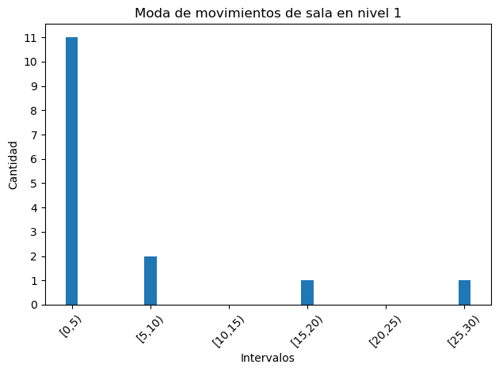
    


    En el nivel 1 la cantidad más repetida/s de movimientos necesarios es/son la/s siguiente/s
    [ 0 , 5 )
    Repitiendose un total de  11  veces
    


    
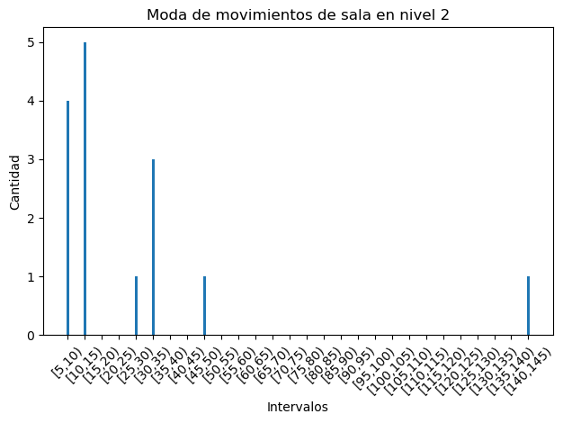
    


    En el nivel 2 la cantidad más repetida/s de movimientos necesarios es/son la/s siguiente/s
    [ 10 , 15 )
    Repitiendose un total de  5  veces
    

# Métrica 3: Precisión de golpes a los enemigos
¿El jugador falla significativamente más ataques en el nivel 2 que en el nivel 1?


```python

if 8 in groupedEvents.groups:
    attack = groupedEvents.get_group(8)
    enemy_receive = groupedEvents.get_group(9) if 9 in groupedEvents.groups else None
    #display(attack)
    #display(enemy_receive)

    #Se agrupan los ataques realizados y los recibidos por los enemigos y se cuenta el número de cada uno
    attack_count = attack.groupby('Level').size().reset_index(name='Total Attacks')
    
    #Si el grupo 9 existe, contamos los aciertos; de lo contrario, asumimos que son 0
    if enemy_receive is not None:
        hit_count = enemy_receive.groupby('Level').size().reset_index(name='Total Hits')
    else:
        hit_count = pd.DataFrame({'Level': attack_count['Level'], 'Total Hits': 0})
    
    #Agrupar los datos en un único dataframe
    accuracy = pd.merge(attack_count, hit_count, on='Level', how='left')
    accuracy['Total Hits'] = accuracy['Total Hits'].fillna(0)

    #Calcular la precisión de los golpes
    accuracy['Accuracy'] = (accuracy['Total Hits'] / accuracy['Total Attacks']) * 100
    accuracy['Level'] = accuracy['Level'].astype(int)

    plt.figure(figsize=(10, 6))
    plt.bar(accuracy['Level'], accuracy['Accuracy'], color='skyblue')
    plt.xlabel('Level', fontsize=14)
    plt.ylabel('Hit Accuracy (%)', fontsize=14)
    plt.title('Hit Accuracy per Level', fontsize=16)
    plt.xticks(accuracy['Level'])
    plt.ylim(0, 100)
    plt.show()
    
    accuracy['Accuracy'] = accuracy['Accuracy'].apply(lambda x: f"{x:.2f}%")
    print("Precisión de golpes a los enemigos:\n")
    display(accuracy[['Level', 'Accuracy']])
    accuracy[['Level', 'Accuracy']].to_string(index=False)
    #Separar por niveles
    level_1_accuracy = accuracy[accuracy['Level'] == 1]['Accuracy'].values[0]
    level_2_accuracy = accuracy[accuracy['Level'] == 2]['Accuracy'].values[0]
    #Quitar '%'
    level_1_accuracy = float(level_1_accuracy.replace('%', ''))
    level_2_accuracy = float(level_2_accuracy.replace('%', ''))

    if level_1_accuracy > level_2_accuracy:
        difference_percentage = level_1_accuracy - level_2_accuracy
        print(f"La media de la precisión de golpes a enemigos en el nivel 1 es mayor que la del nivel 2 por un {difference_percentage:.2f}%.")
    elif level_1_accuracy < level_2_accuracy:
        difference_percentage = level_2_accuracy - level_1_accuracy
        print(f"La media de la precisión de golpes a enemigos en el nivel 2 es mayor que la del nivel 1 por un {difference_percentage:.2f}%.")
    else:
        print("La media de la precisión de golpes a enemigos en el nivel 1 es igual a la del nivel 2.")
else:
    print("Nunca se han llevado a cabo ataques.")

```


    
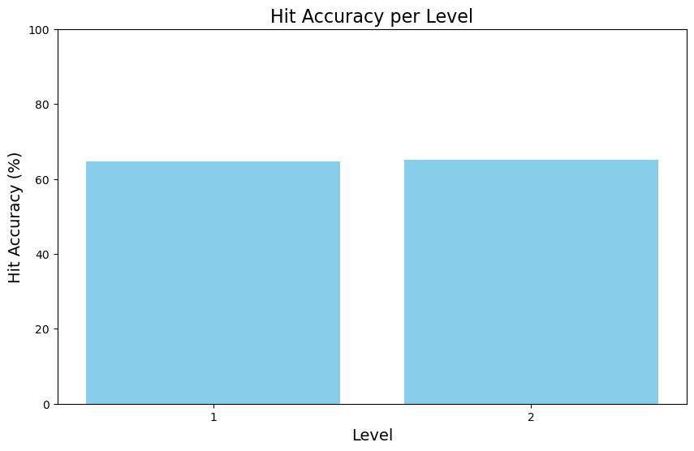
    


    Precisión de golpes a los enemigos:
    
    


<div>
<style scoped>
    .dataframe tbody tr th:only-of-type {
        vertical-align: middle;
    }

    .dataframe tbody tr th {
        vertical-align: top;
    }

    .dataframe thead th {
        text-align: right;
    }
</style>
<table border="1" class="dataframe">
  <thead>
    <tr style="text-align: right;">
      <th></th>
      <th>Level</th>
      <th>Accuracy</th>
    </tr>
  </thead>
  <tbody>
    <tr>
      <th>0</th>
      <td>1</td>
      <td>64.71%</td>
    </tr>
    <tr>
      <th>1</th>
      <td>2</td>
      <td>65.00%</td>
    </tr>
  </tbody>
</table>
</div>


    La media de la precisión de golpes a enemigos en el nivel 2 es mayor que la del nivel 1 por un 0.29%.
    

# Métrica 4: Impactos de los elementos dañinos
Se estudiará la distribución del número de veces que cada elemento dañino(enemigos, sierra, alcantarilla) impacta al jugador. Se calculará el porcentaje de impactos de cada obstáculo con respecto al total de impactos.


```python
player_receive = groupedEvents.get_group(10)

#Se agrupan los impactos por sesión y tipo de enemigo y se cuenta el número de cada una
impact_count = player_receive.groupby(['Level', 'EnemyType']).size().reset_index(name='Impacts')

#Impactos totales por sesión
total_impact_count = player_receive.groupby('Level').size().reset_index(name='Total Impacts')

#Agrupar los datos en un único dataframe
impact_count = impact_count.merge(total_impact_count, on='Level', how='left')

#Calcular porcentaje de impactos provocados por cada tipo de enemigo
impact_count['Accuracy'] = (impact_count['Impacts'] / impact_count['Total Impacts']) * 100

#Mapeo de nombres de enemigos
enemy_names = {
    0: "Robot",
    1: "Spider",
    2: "Saw",
    3: "Sewer"
}
impact_count['EnemyType'] = impact_count['EnemyType'].map(enemy_names)

levels = impact_count['Level'].unique()

for level in levels:
    data_level = impact_count[impact_count['Level'] == level]
    
    plt.figure(figsize=(8, 8))
    plt.pie(data_level['Accuracy'], labels=data_level['EnemyType'].astype(str), autopct='%1.1f%%', startangle=140)
    plt.title(f'Porcentaje de Impactos por Tipo de Enemigo en el Nivel {level}')
    plt.show()
    
impact_count['Accuracy'].fillna(0, inplace=True)
impact_count['AccuracyText'] = impact_count['Accuracy'].apply(lambda x: f"{x:.3f}%")

```


    
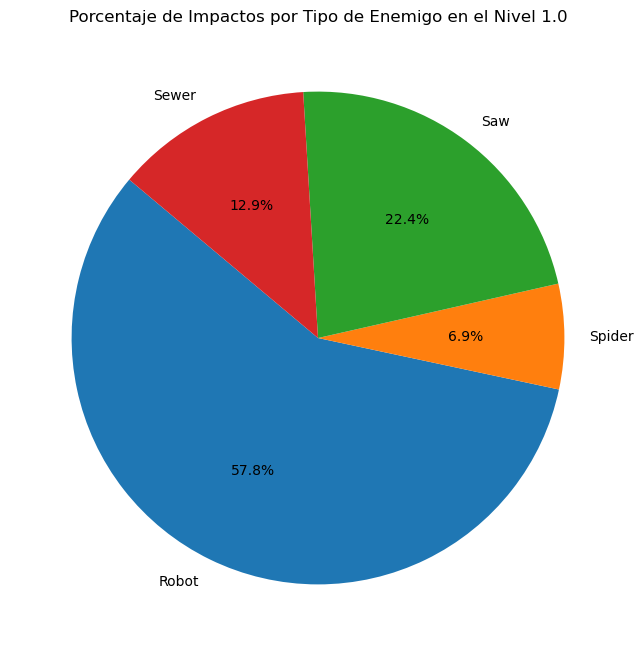
    


    

    


# Conclusiones según los resultados
A continuación, en base a los resultados que hemos obtenido en el cálculo de métricas con las trazas que hemos proporcionado, vamos a responder las preguntas de investigación formuladas.

### 1. ¿El jugador tarda demasiado tiempo en completar cada uno de los dos niveles?

Basándonos en los datos proporcionados con los histogramas y las medias, medianas y desviaciones típicas:

#### Nivel 1
    
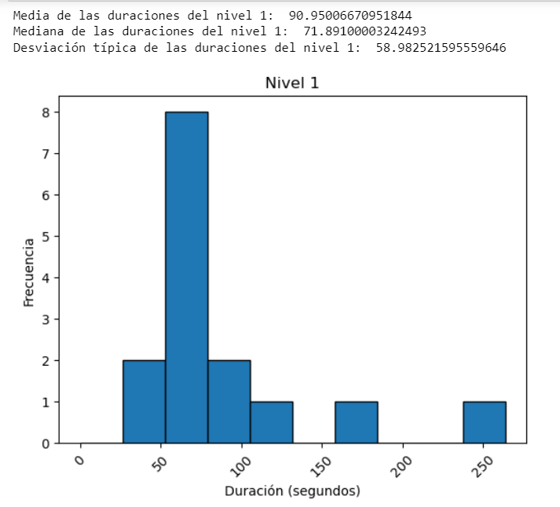
#### Nivel 2
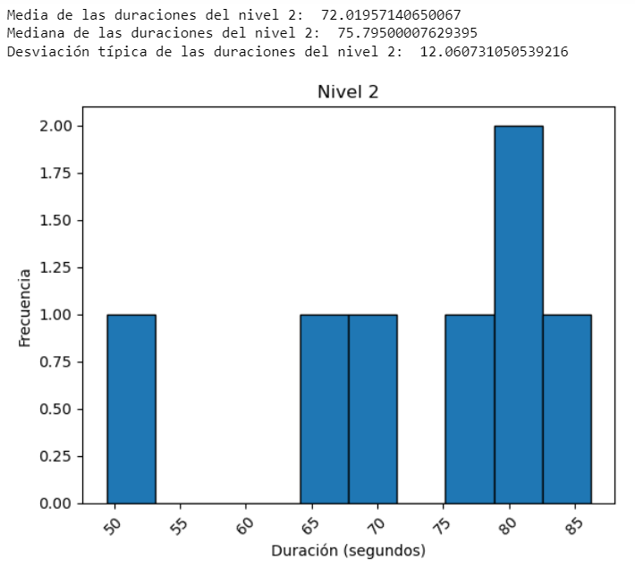

Podemos hacer las siguientes observaciones:

- Para el **nivel 1**, la media de duración es significativamente más alta que la mediana, lo cual sugiere que hay algunos eventos con duraciones muy largas que están afectando a la media. Además, la desviación típica es relativamente alta (58.98 segundos), lo que indica una gran variabilidad en las duraciones.

- Para el **nivel 2**, la media y la mediana de las duraciones son bastante cercanas (72.02 segundos y 75.79 segundos, respectivamente), lo que indica una distribución más uniforme de las duraciones de los eventos. Además, la desviación típica es relativamente baja (12.06 segundos), lo que sugiere que las duraciones de los eventos en este nivel tienden a ser más consistentes. Esto podría indicar que los eventos en el nivel 2 se completan en tiempos más consistentes en comparación con el nivel 1.

Pero debemos considerar que el número de trazas analizadas del nivel 2, son aproximadamente la mitad de las trazas analizadas del nivel 1. Esto indica que el nivel 2 tiene mayor dificultad respecto al nivel uno, por lo que se disponen de menos trazas válidas, ya que **solo se consideran los niveles completados con éxito**.

En conclusión, el jugador **NO tarda demasiado en completar los niveles** ya que gracias al histograma podemos apreciar que la mayoría de jugadores tardan tiempos parecidos. En el caso del nivel 1, hay un caso extremo que modifica mucho la media, por lo que lo idóneo sería no tener en cuenta este dato. Al suprimirlo la media se reduciría en más de 15 segundos, concluyendo en una distribución más homogénea. A pesar de la mayor dificultad del nivel 2, presenta unos tiempos muy reducidos respecto al nivel 1.

Sería recomendable hacer pruebas con usuarios y en función de los resultados, rediseñar el nivel 2, ya que se completa bastantes menos veces en comparación con el nivel 1, y de tantos intentos fallidos, los jugadores aprenden la combinación y lo completan con tiempos muy pequeños.

### 2. ¿El jugador usa demasiados movimientos de salas en cada uno de los dos niveles?

Presentamos a continuación los histogramas que muestran el número de movimientos de sala, en intervalos de 5 en los dos niveles evaluados:

#### Nivel 1
    
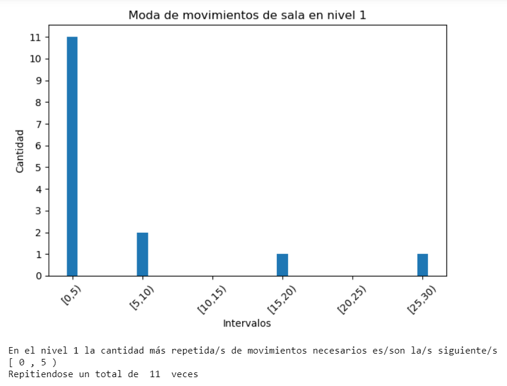

#### Nivel 2
    
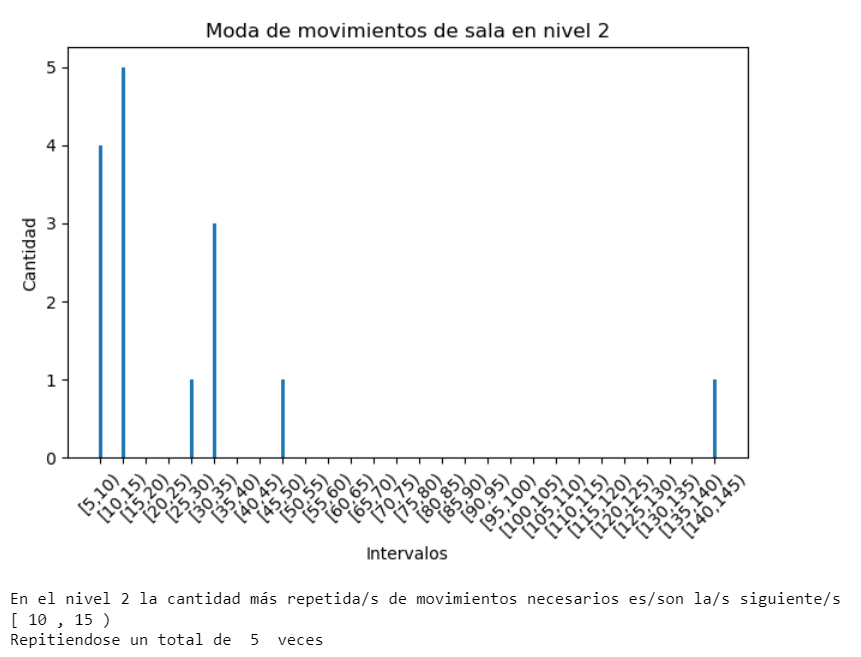

En ambos niveles, el jugador muestra un uso moderado de movimientos de sala. En el nivel 1, la mayoría de las veces (11 veces) el jugador requiere entre 0-5 movimientos para avanzar, lo cual indica cierta eficiencia. Sin embargo, también se observa que en algunas instancias (4 veces en total) se necesitan más de 10 movimientos.
En el nivel 2, la cantidad más repetida de movimientos se encuentra en el rango de 10-15 movimientos (5 veces), aunque tambien tenemos intervalos con bastantes repeticiones como por ejemplo el 5-10. Por otra parte, hay un caso en el que se realizaron más de 140 movimientos, lo cual consideramos un exceso puntual. En caso de que hubiera más datos de estas características, se consideraría un problema de diseño de nivel.

Como la mayoría de los datos se encuentran en el extremo izquierdo del histograma, indica que el número de movimientos tiende a ser menor, salvo algún caso aislado que se encuentra en el otro extremo. En conclusión, el jugador **NO usa demasiados movimientos de salas en cada uno de los niveles**.


### 3. ¿El jugador falla significativamente más ataques en el nivel 2 que en el nivel 1?

Presentamos a continuación el histograma que muestra el porcentaje de aciertos de ataque a enemigos en los dos niveles evaluados:

    


La diferencia de porcentajes entre los dos niveles varía en menos de un 1%, lo que nos lleva a pensar que la diferencia de dificultad entre niveles, no viene determinada por el ataque a enemigos. 

En conclusión, el jugador **NO falla significativamente más ataques en el nivel 2, que en el nivel 1.** Por otro lado, los porcentajes de acierto son bajos, se debería considerar un rediseño de la mecánica de ataque para mejorar estos porcentajes.

### 4. ¿Es coherente la variación de impactos provocados por cada elemento dañino a lo largo de los dos niveles?

Presentamos a continuación las gráficas que muestran el porcentaje de impactos por tipo de enemigo en los dos niveles evaluados: 

#### Nivel 1


#### Nivel 2


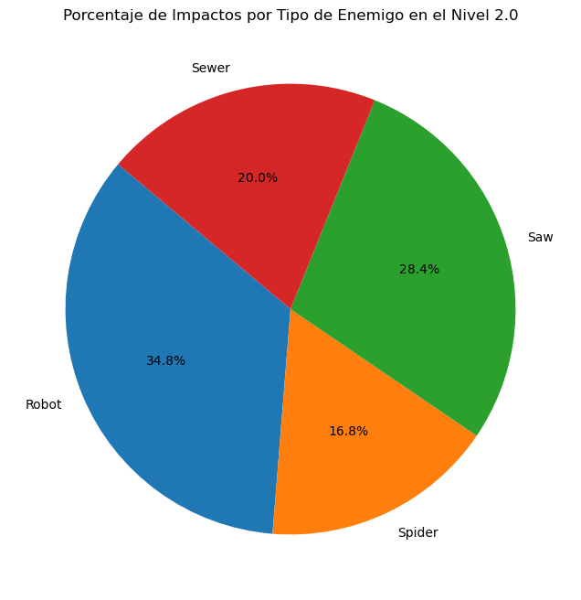

A partir de estas gráficas resultantes, realizamos el siguiente análisis :

En el nivel 1 se aprecia que el Robot tiene un alto porcentaje de impactos (57.8%), al contrario que este, la Araña presenta un porcentaje muy reducido (6.9%). En cuanto al nivel 2, el porcentaje del robot disminuye considerablemente, situandose en un 34.8%. Por su parte, el porcentaje de impactos de la araña aumenta hasta un 16.8%, que sigue siendo un porcentaje bastante bajo. La variación de impactos del Robot entre niveles es muy grande, ya que disminuye más de un 20% entre el nivel 1 y el 2. En cuanto al resto de elementos dañinos, poseen porcentajes más homogéneos, tanto los porcentajes de la Sierra como los de la Alcantarilla presentan una variación menor al 10% entre los niveles.

Tras este análisis, llegamos a la conclusión de que **la variación de impactos provocados por cada elemento dañino a lo largo de los dos niveles NO es coherente** debido sobre todo a la variación que impactos que presenta el Robot. Para solucionar esto se proponen las siguientes soluciones:

- Rediseñar la distribución y/o el número de instancias de los Robots en el nivel 1. Pese a ser el enemigo que se esperaba que tuviese más impactos en ambos niveles, en este nivel posee un porcentaje muy elevado.
- Rediseño de la Araña. Viendo los resultados obtenidos, especialmente en el primer nivel, su porcentaje de impactos es ínfimo. Si se desea que este enemigo tenga mayor importancia debería considerarse modificar su comportamiento.
